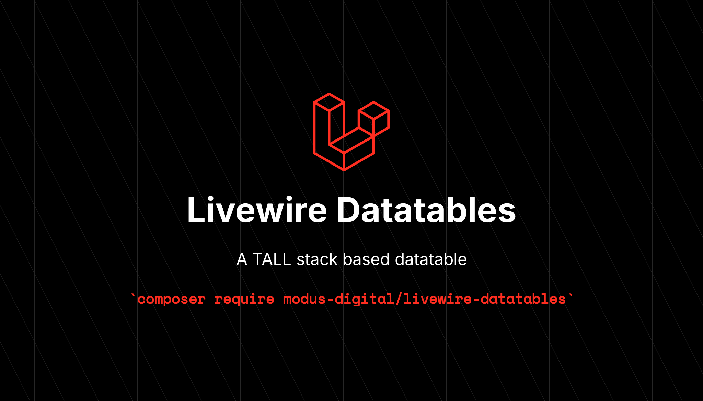

# Livewire Datatables

<!-- Art -->


<p align="center">
    <a href="https://packagist.org/packages/modus-digital/livewire-datatables">
        
    </a>
    <a href="https://github.com/modus-digital/livewire-datatables/actions?query=workflow%3Arun-tests+branch%3Amain">
        
    </a>
    <a href="https://github.com/modus-digital/livewire-datatables/actions?query=workflow%3A%22Fix+PHP+code+style+issues%22+branch%3Amain">
        
    </a>
    <a href="https://packagist.org/packages/modus-digital/livewire-datatables">
        
    </a>
</p>

A modern, feature-rich **Livewire Datatable** component for the TALL stack (Tailwind CSS, Alpine.js, Laravel, Livewire). Built with modularity, performance, and developer experience in mind.

## ✨ Features

-   🎨 **Beautiful Tailwind CSS styling** with dark mode support
-   🔍 **Global search** with debounced input and relationship support
-   🗂️ **Advanced filtering** with multiple filter types (Text, Select, Date)
-   📊 **Column sorting** with visual indicators and custom sort fields
-   📄 **Pagination** with customizable page sizes and navigation
-   ✅ **Row selection** with bulk actions and "select all" functionality
-   🎯 **Row actions** with customizable buttons and callbacks
-   🖼️ **Multiple column types** (Text, Icon, Image) with specialized features
-   🏷️ **Badge support** with dynamic colors and callbacks
-   🔗 **Clickable rows** with custom handlers
-   🔭 **Custom cell views** for complex content rendering
-   🚀 **Performance optimized** with efficient querying

## 📋 Requirements

| Requirement      | Version            |
| ---------------- | ------------------ |
| **PHP**          | `^8.3`             |
| **Laravel**      | `^11.0` or `^12.0` |
| **Livewire**     | `^3.0`             |
| **Tailwind CSS** | `^4.0`             |
| **Alpine.js**    | `^3.0`             |

## 📦 Installation

Install the package via Composer:

```bash
composer require modus-digital/livewire-datatables
```

The package will automatically register its service provider.

### Publishing Views (Optional)

To customize the table appearance, publish the views:

```bash
php artisan vendor:publish --tag="livewire-datatables-views"
```

This publishes all Blade templates to `resources/views/vendor/livewire-datatables/`.

### Publishing Config (Optional)

To customize the package, you can publish the config file:

```bash
php artisan vendor:publish --tag="livewire-datatables-config"
```

This publishes a config file to `config/livewire-datatables.php`

### Source frontend styles

To automatically source the frontend using tailwind, include the following files to the `app.css`

```css
@source '../../vendor/modus-digital/livewire-datatables/resources/**/*.blade.php';
@source '../../vendor/modus-digital/livewire-datatables/src/**/*.php';
```

## 🚀 Quick Start

### 1. Generate a Table Component

Use the built-in Artisan command to scaffold a new table:

```bash
php artisan make:table UsersTable --model=App\\Models\\User
```

Or create one manually:

```php
<?php

declare(strict_types=1);

namespace App\Livewire\Tables;

use App\Models\User;
use ModusDigital\LivewireDatatables\Livewire\Table;
use ModusDigital\LivewireDatatables\Columns\Column;
use ModusDigital\LivewireDatatables\Columns\TextColumn;
use ModusDigital\LivewireDatatables\Filters\SelectFilter;

class UsersTable extends Table
{
    protected string $model = User::class;

    protected function columns(): array
    {
        return [
            TextColumn::make('Name')
                ->field('name')
                ->sortable()
                ->searchable(),

            TextColumn::make('Email')
                ->field('email')
                ->sortable()
                ->searchable(),

            TextColumn::make('Status')
                ->field('status')
                ->badge()
                ->sortable(),

            TextColumn::make('Created')
                ->field('created_at')
                ->sortable()
                ->format(fn($value) => $value->diffForHumans()),
        ];
    }

    protected function filters(): array
    {
        return [
            SelectFilter::make('Status')
                ->options([
                    'active' => 'Active',
                    'inactive' => 'Inactive',
                    'banned' => 'Banned',
                ])
                ->multiple(),   // <-- This is optional
        ];
    }
}
```

### 2. Use in Your Blade Template

```blade
<livewire:users-table />
```

## 📚 Documentation

### Column Types

#### Base Column

De basis met alle kernopties:

```php
Column::make('Name')
    ->field('name')                    // Database field (ook: 'relation.field')
    ->sortable()                       // Kolom sorteerbaar maken
    ->searchable()                     // Opnemen in globale zoek
    ->hidden()                         // Verbergen
    ->width('150px')                   // CSS breedte (bv. '150px', '20%')
    ->align('center')                  // 'left' | 'center' | 'right'
    ->view('custom.cell')              // Custom Blade view voor de cel
    ->sortField('users.name')          // Aparte sorteer-field (optioneel)
    ->format(fn ($value, $record) => strtoupper((string) $value));
```

#### TextColumn

Extra’s voor tekstweergave:

```php
TextColumn::make('Description')
    ->field('description')
    ->limit(50)                        // Tekst afkappen
    ->badge('blue')                    // Badge tonen (kleur vast of via Closure)
    ->fullWidth();                     // Badge over volle breedte
```

#### IconColumn

```php
IconColumn::make('Status')
    ->field('is_active')
    ->icon(fn ($record) => $record->is_active ? 'fa-check' : 'fa-times')
    ->count(fn ($record) => $record->notifications_count);
```

#### ImageColumn

```php
ImageColumn::make('Avatar')
    ->field('avatar_url')
    ->src(fn ($record) => $record->getAvatarUrl())
    ->circle();                        // Rond i.p.v. vierkant
```

Relatievelden gebruik je met dot-notatie in `field`:

```php
Column::make('Department')
    ->field('department.name')         // Relationele kolom
    ->sortable();
```

Voor aangepaste SQL sortering via een andere kolom:

```php
Column::make('Department')
    ->field('department.name')
    ->sortField('departments.name');
```

### Filters

#### TextFilter

```php
use ModusDigital\LivewireDatatables\Filters\TextFilter;

TextFilter::make('Name')
    ->field('name')
    ->placeholder('Search names...')
    ->contains();        // ook: ->exact(), ->startsWith(), ->endsWith()
```

#### SelectFilter

```php
use ModusDigital\LivewireDatatables\Filters\SelectFilter;

SelectFilter::make('Status')
    ->field('status')
    ->options([
        'active' => 'Active Users',
        'inactive' => 'Inactive Users',
        'banned' => 'Banned Users',
    ])
    ->placeholder('All Statuses')
    ->multiple();
```

#### DateFilter

```php
use ModusDigital\LivewireDatatables\Filters\DateFilter;

DateFilter::make('Created')
    ->field('created_at')
    ->range()            // datumbereik (from/to)
    ->format('Y-m-d');
```

Filters werken ook op relatievelden (`field('relation.attribute')`). Indien een veld een Eloquent attribute/accessor is, valt filtering terug op PHP (na ophalen) voor correcte resultaten.

### Row selection

Rijselectie inschakelen en gebruiken:

```php
class UsersTable extends Table
{
    // Of via config('livewire-datatables.checkboxes')
    public bool $showSelection = true;
}
```

Geselecteerde IDs vind je in `$this->selected` (array). Combineer dit met een globale actie om bulk-operaties te doen (zie hieronder).

### Row Actions

Voeg rijacties met callbacks toe:

```php
use ModusDigital\LivewireDatatables\Actions\RowAction;

protected function rowActions(): array
{
    return [
        RowAction::make('edit', 'Edit')
            ->class('text-blue-600')
            ->callback(fn ($row, $table) => redirect()->route('users.edit', $row)),

        RowAction::make('delete', 'Delete')
            ->confirm('Delete this user?')
            ->callback(function ($row) {
                $row->delete();
                session()->flash('message', 'User deleted successfully.');
            }),
    ];
}
```

Je kunt zichtbaarheid conditioneel maken met `->visible(fn ($row) => ...)` en een `->icon()` string meegeven.

### Global Actions

Header-acties met callback (handig voor bulk op `$this->selected`):

```php
use ModusDigital\LivewireDatatables\Actions\Action;

protected function actions(): array
{
    return [
        Action::make('create', 'Add User')
            ->class('bg-blue-600 hover:bg-blue-700 text-white')
            ->callback(fn ($table) => redirect()->route('users.create')),

        Action::make('delete-selected', 'Delete Selected')
            ->class('bg-red-600 hover:bg-red-700 text-white')
            ->confirm('Delete all selected users?')
            ->callback(function ($table) {
                $ids = $table->selected;
                if (! empty($ids)) {
                    \App\Models\User::whereIn('id', $ids)->delete();
                    $table->deselectAll();
                }
            }),
    ];
}
```

### Clickable Rows

Maak hele rijen klikbaar door `showRecord` te overriden:

```php
public function showRecord(string|int $id): void
{
    // Bijvoorbeeld:
    redirect()->route('users.show', $id);
}
```

### Pagination Configuration

```php
class UsersTable extends Table
{
    public int $perPage = 25;                    // Standaard page size
    protected array $perPageOptions = [10, 25, 50, 100];
}
```

### Search Configuration

```php
class UsersTable extends Table
{
    protected bool $searchable = true;
    protected string $searchPlaceholder = 'Search users...';
}
```

### Empty State Customization

Publiceer de views en pas `resources/views/vendor/livewire-datatables/partials/empty-state.blade.php` aan:

```blade
<h3 class="mt-2 text-sm font-medium">No records</h3>
<p class="mt-1 text-sm">Try adjusting your filters.</p>
```

### Custom Query Building

```php
protected function query(): Builder
{
    return $this->getModel()
        ->query()
        ->with(['profile', 'roles']);
}
```

### Relationship Handling

Gebruik dot‑notatie in `field('relation.column')`. Voor sorting over relaties gebruik je `->sortField('related_table.column')`. Wanneer je sorteert op een attribute/accessor, wordt automatisch in PHP gesorteerd na ophalen.

## 🎨 Styling & Customization

### Dark Mode Support

The package includes full dark mode support using Tailwind's `dark:` variants. Ensure your project has dark mode configured:

```css
@source '../../vendor/modus-digital/livewire-datatables/resources/views/**/*.blade.php';
```

### Custom Views

Create custom cell views for complex content:

```php
Column::make('Actions')
    ->view('components.user-actions')
    ->width('w-32'),
```

```blade
<!-- resources/views/components/user-actions.blade.php -->
<div class="flex space-x-2">
    <button wire:click="editUser({{ $record->id }})" class="text-blue-600">
        Edit
    </button>
    <button wire:click="deleteUser({{ $record->id }})" class="text-red-600">
        Delete
    </button>
</div>
```

### Badge Colors

Available badge colors for TextColumn:

-   `gray` (default)
-   `red`
-   `yellow`
-   `green`
-   `blue`
-   `indigo`
-   `purple`
-   `pink`

```php
TextColumn::make('Status')
    ->badge(fn($record) => match($record->status) {
        'active' => 'green',
        'pending' => 'yellow',
        'banned' => 'red',
        default => 'gray'
    });
```

## 🏗️ Architecture

The package follows a modular trait-based architecture:

### Core Traits

-   **`HasColumns`** - Column management and rendering (120 lines)
-   **`HasFilters`** - Filter functionality and application (149 lines)
-   **`HasPagination`** - Pagination configuration (67 lines)
-   **`HasSorting`** - Sorting logic and state management (132 lines)
-   **`HasRowSelection`** - Row selection and bulk actions (142 lines)
-   **`HasRowActions`** - Individual row action handling (92 lines)
-   **`HasActions`** - Global header actions (59 lines)

Each trait is focused, testable, and can be understood independently.

## 🧪 Testing

The package includes comprehensive tests using **Pest 3**:

```bash
# Run all tests
composer test

# Run static analysis
composer analyse

# Fix code style
composer format
```

## 🔧 Development

### Code Quality Tools

The package uses several tools to maintain high code quality:

-   **Pest 3** - Modern PHP testing framework
-   **Larastan** - Static analysis for Laravel
-   **Laravel Pint** - Code style fixer
-   **PHPStan** - Static analysis with strict rules

### Contributing Workflow

1. Fork the repository
2. Create a feature branch
3. Write tests for new functionality
4. Ensure all tests pass: `composer test`
5. Fix code style: `composer format`
6. Run static analysis: `composer analyse`
7. Submit a pull request

## 📝 Changelog

See [CHANGELOG.md](CHANGELOG.md) for recent changes and version history.

## 👥 Credits

-   [Alex van Steenhoven](https://github.com/AlexVanSteenhoven) - Creator & Maintainer
-   [Modus Digital](https://github.com/modus-digital) - Organization
-   [All Contributors](../../contributors)

## 📄 License

The MIT License (MIT). Please see [License File](LICENSE.md) for more information.
